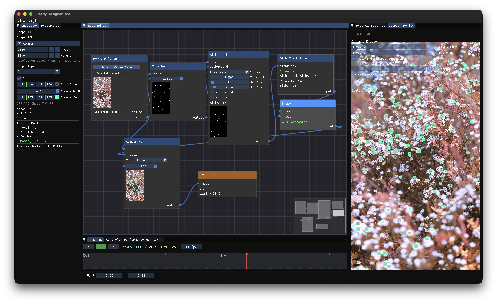
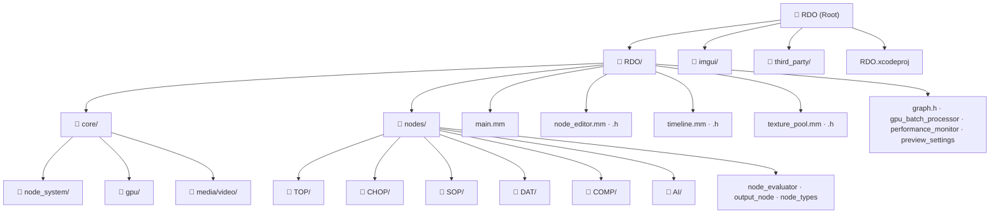
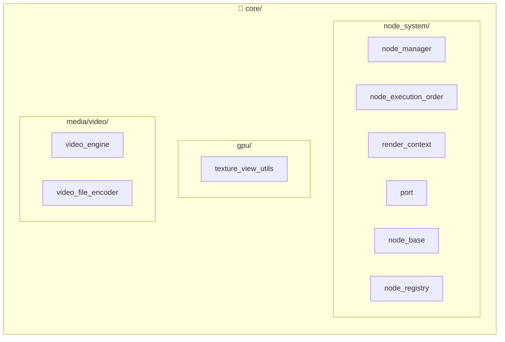
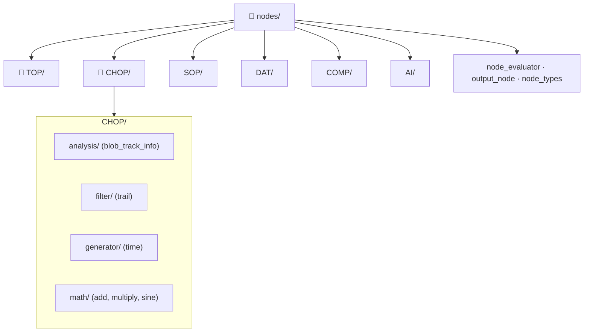

# RDO (Ready Designer One)

A node-based real-time video and graphics prototyping tool.  
Provides a TouchDesigner-style **TOP / CHOP node system** with a visual node editor.

> 🎯 **Current Main Feature: Blob Tracking**  
> Detects and tracks blobs in real time from image or video inputs.

---

> **⚠️ Project Status**  
> This project is in a very early stage.  
> This is the first Metal-based application developed in this project, so parts of the codebase may lack structure or refinement.  
> Developed with assistance from CODEX. Naming conventions (variables, functions, files) are not fully unified yet.  
> Unexpected bugs or crashes may occur. Refactoring and naming standardization are planned.

---

## 🎬 Demo

### 🧠 Workspace Demo (Main)

  

  <b>RDO Workspace Demo</b> 
  Node graph configuration · Real-time Blob Tracking · TOP/CHOP workflow

  ▶️ <a href="docs/media/RDO_workspace_video.mp4">Watch Video</a>

---

## 🖥 Workspace Screenshot

  

---

## 🎥 Output Examples

<table>
<tr>
<td align="center">
 
<b>Firework Output</b> 
<a href="docs/media/firework.mp4">Watch Video</a>
</td>

<td align="center">
 
<b>Flower Output</b> 
<a href="docs/media/flower.mp4">Watch Video</a>
</td>
</tr>
</table>

---

## Key Features

- **Blob Tracking** – Main feature. Detects and tracks blobs from video/image input
- **Node Editor** – Visual graph editing based on ImNodes
- **TOP (Texture Operator)** – Image/video processing pipeline (blur, color correction, compositing, tracking, etc.)
- **CHOP (Channel Operator)** – Channel/signal processing (math, filters, trails, etc.)
- **Metal GPU** – High-performance rendering using macOS Metal
- **Video Engine** – Media playback and encoding support

---

## Tech Stack

| Category | Technology |
|----------|------------|
| Platform | macOS |
| GPU | Metal |
| UI | Dear ImGui, ImNodes |
| Language | C++, Objective-C++ |

---

## Project Structure

### Root Structure

### core/ Details

### nodes/ Details

---

## Build Instructions

1. Open `RDO.xcodeproj` in **Xcode**
2. Select the **RDO** scheme
3. Press **Run (⌘R)**

### Requirements
- macOS
- Latest Xcode
- Metal-supported Mac

---

## License

Check the license applied to each project component.  
Third-party libraries (Dear ImGui, ImNodes, etc.) follow their respective licenses.
